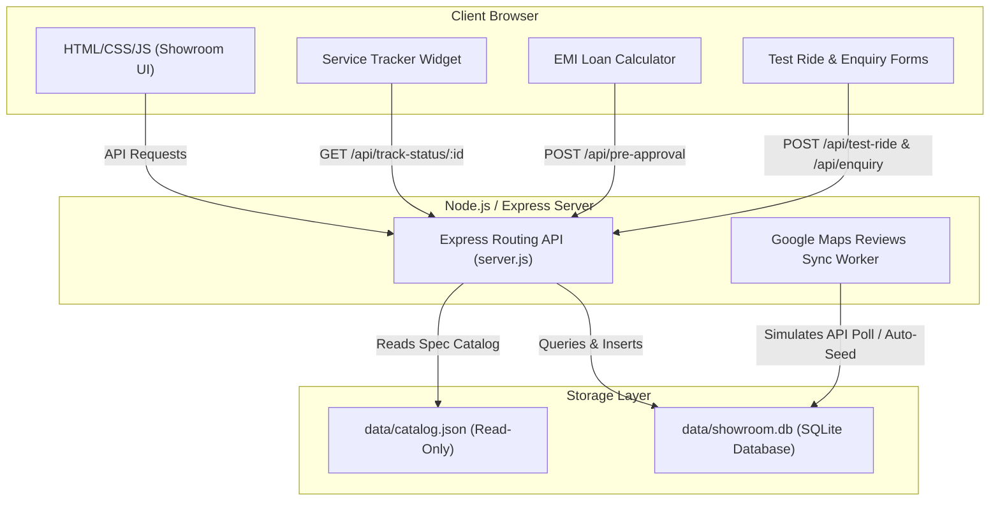

# M/S. Pavizham Associates - Premium Hero MotoCorp Showroom Hub

A premium, state-of-the-art digital showroom and customer portal for **M/S. Pavizham Associates**, the authorized Hero MotoCorp dealer located in Payyanur, Kerala. This application integrates an interactive bike catalog, dynamic EMI calculation with pre-approval, quick test-ride scheduling, a live service status tracker, and a customer review hub.

---

## 🏗️ Architecture

The system uses a lightweight, high-performance client-server architecture consisting of a **Vanilla HTML5/CSS3/JS Single-Page Frontend** and a **Node.js/Express Backend** backed by a local **SQLite database**.



---

## 💻 Tech Stack

### Frontend
* **Core Structure & UI:** Single-page app using [pavizham_hero_premium_showroom_hub.html](file:///e:/AI_Job%20Prep/Freelancing/Pavizham%20Hero%20Website/pavizham_hero_premium_showroom_hub.html).
* **Styling & Aesthetics:** Premium custom dark mode, glassmorphism, responsive grid system, CSS variables, and keyframe micro-animations.
* **Logic:** Vanilla JavaScript for DOM manipulation, local calculations, dynamic filtering, and async `fetch` API requests.

### Backend
* **Runtime Environment:** Node.js
* **Framework:** Express.js (configured in [server.js](file:///e:/AI_Job%20Prep/Freelancing/Pavizham%20Hero%20Website/server.js))
* **Middleware:** `cors`, `express.json()`, `express.static`

### Database & Storage
* **Primary Storage:** SQLite3 ([database.js](file:///e:/AI_Job%20Prep/Freelancing/Pavizham%20Hero%20Website/database.js)) stored locally as a single file at [showroom.db](file:///e:/AI_Job%20Prep/Freelancing/Pavizham%20Hero%20Website/data/showroom.db).
* **Read-Only Catalog:** [catalog.json](file:///e:/AI_Job%20Prep/Freelancing/Pavizham%20Hero%20Website/data/catalog.json) containing specifications, images, and price details for all Hero vehicles.

---

## 🗄️ Database Schema & Data Models

The SQLite database file [showroom.db](file:///e:/AI_Job%20Prep/Freelancing/Pavizham%20Hero%20Website/data/showroom.db) consists of five tables. When the application starts, schema creation is checked and default values are seeded if the tables are empty.

### 1. `test_rides`
Stores quick test-ride booking requests.
| Column | Type | Constraints | Description |
| :--- | :--- | :--- | :--- |
| `id` | TEXT | PRIMARY KEY | Unique ID prefixed with `TR-` |
| `model` | TEXT | NOT NULL | Hero model selected for test ride |
| `phone` | TEXT | NOT NULL | Customer contact phone number |
| `timestamp`| TEXT | NOT NULL | ISO 8601 timestamp of booking |

### 2. `enquiries`
Logs general showroom enquiries and finance requests.
| Column | Type | Constraints | Description |
| :--- | :--- | :--- | :--- |
| `id` | TEXT | PRIMARY KEY | Unique ID prefixed with `ENQ-` |
| `name` | TEXT | NOT NULL | Customer name |
| `phone` | TEXT | NOT NULL | Contact number |
| `model` | TEXT | NOT NULL | Vehicle model of interest |
| `finance` | TEXT | NOT NULL | Finance option choice (`Yes` / `No`) |
| `notes` | TEXT | - | Additional customer message / notes |
| `timestamp`| TEXT | NOT NULL | ISO 8601 timestamp of submission |

### 3. `pre_approvals`
Logs estimated EMI details submitted for loan pre-approvals.
| Column | Type | Constraints | Description |
| :--- | :--- | :--- | :--- |
| `id` | TEXT | PRIMARY KEY | Unique ID prefixed with `PRE-` |
| `name` | TEXT | NOT NULL | Applicant name |
| `phone` | TEXT | NOT NULL | Applicant phone number |
| `bike` | TEXT | NOT NULL | Selected vehicle model |
| `emi` | TEXT | NOT NULL | Calculated monthly EMI value |
| `timestamp`| TEXT | NOT NULL | ISO 8601 timestamp of submission |

### 4. `reviews`
Tracks customer reviews and auto-synced reviews from Google.
| Column | Type | Constraints | Description |
| :--- | :--- | :--- | :--- |
| `id` | INTEGER| PRIMARY KEY AUTOINCREMENT | Unique review ID |
| `author` | TEXT | NOT NULL | Name of the reviewer |
| `rating` | INTEGER| NOT NULL | Rating count (1-5 stars) |
| `comment` | TEXT | NOT NULL | Review review body / text |
| `date` | TEXT | NOT NULL | Formatted date string (`DD-MM-YYYY`) |
| `timestamp`| TEXT | NOT NULL | ISO 8601 creation timestamp |

### 5. `service_status`
Keeps track of real-time service updates for active Job Cards.
| Column | Type | Constraints | Description |
| :--- | :--- | :--- | :--- |
| `job_card` | TEXT | PRIMARY KEY | Job Card number (e.g. `PV-901`) |
| `heading` | TEXT | NOT NULL | Current status title (e.g., "In Wash Bay") |
| `body` | TEXT | NOT NULL | Detail update text |
| `glow_color`| TEXT | NOT NULL | Tailwind/CSS background class for status glow |

---

## 🔌 API Documentation

| Endpoint | Method | Payload (JSON) | Response (JSON) | Description |
| :--- | :--- | :--- | :--- | :--- |
| `/api/catalog` | `GET` | None | `{ vehiclesList: [...], specsDetail: {...} }` | Retrieves the static vehicle specifications catalog. |
| `/api/test-ride` | `POST` | `{ "model": "Xpulse 200 4V", "phone": "9876543210" }` | `{ "message": "...", "booking": {...} }` | Schedules a quick test-ride booking. |
| `/api/enquiry` | `POST` | `{ "name": "Anoop", "phone": "9447223344", "model": "Mavrick 440", "finance": "Yes", "notes": "Need details on exchange." }` | `{ "message": "...", "enquiry": {...} }` | Submits a detailed showroom enquiry form. |
| `/api/pre-approval` | `POST` | `{ "name": "Maya", "phone": "9080706050", "bike": "Destini 125 XTEC", "emi": "₹ 2,450 / month" }` | `{ "message": "...", "preApproval": {...} }` | Submits calculated EMI configurations for pre-approval. |
| `/api/track-status/:id` | `GET` | None (URL Param `:id` is job_card) | `{ "heading": "...", "body": "...", "glowColor": "..." }` | Returns the live service stage and notes for a specific Job Card. |
| `/api/reviews` | `GET` | None | `[ { "author": "...", "rating": 5, "comment": "...", "date": "..." }, ... ]` | Fetches reviews. Automatically triggers Google Maps review sync if 5 mins have passed since last load. |
| `/api/reviews` | `POST` | `{ "author": "Rohan", "rating": 5, "comment": "Very friendly staff!", "date": "04-08-2026" }` | Updated list of all reviews | Submits a new local review to the showroom database. |

---

## 🚀 How to Run Locally

### Prerequisites
Make sure you have **Node.js** (v16.0.0 or higher) installed on your system.

### Steps
1. Navigate to the project root directory.
2. Install the backend dependencies:
   ```bash
   npm install
   ```
3. Run the development server:
   ```bash
   npm run dev
   ```
4. Open your browser and navigate to:
   ```
   http://localhost:3001
   ```

---

## 🌐 Deployment Plan

Since the application uses a local SQLite database file, typical serverless environments (like AWS Lambda, Vercel, or Netlify) are **not suitable** on their own because their filesystems are ephemeral (all data writes to SQLite would be lost when the server restarts or scales down).

Here are the recommended deployment architectures:

### Option A: Render or Railway (Recommended, Easiest)
1. **Hosting Platform:** Set up a web service on **Render.com** or **Railway.app**.
2. **Persistent Volume:** Attach a **Persistent Disk/Volume** (size: 1GB is more than enough for SQLite database storage) to your service.
3. **Mount Path:** Mount the persistent disk to `/opt/render/project/src/data` (Render) or equivalent workspace path on Railway, and set the environment variable pointing to that path or configure `database.js` to build `dbPath` within the mounted volume path.
4. **Environment Variables:** Define `PORT` (usually auto-configured by the host).

### Option B: VPS Deployment (DigitalOcean / Linode / AWS EC2)
1. **Server Setup:** Provision a basic Ubuntu Linux VPS.
2. **Reverse Proxy:** Install **Nginx** to handle SSL (HTTPS) certifications via Let's Encrypt and reverse-proxy requests from port `80`/`443` to local port `3001`.
3. **Process Manager:** Install and configure **PM2** to run the Node.js app continuously in the background and auto-restart on system boot:
   ```bash
   npm install pm2 -g
   pm2 start server.js --name "pavizham-showroom"
   pm2 startup
   pm2 save
   ```
4. **Data Durability:** Since the VPS disk is persistent, SQLite data remains intact automatically.

### Option C: Serverless with Remote SQLite (e.g., Turso / Cloudflare D1)
If serverless scaling (e.g., Vercel) is preferred for cost or speed, rewrite the database connector in [database.js](file:///e:/AI_Job%20Prep/Freelancing/Pavizham%20Hero%20Website/database.js) to connect to **Turso** (libSQL) or **Cloudflare D1** over HTTP rather than using the local `sqlite3` driver. This lets you serve the frontend and backend on serverless hosting while keeping the database hosted in a cloud SQLite database.
